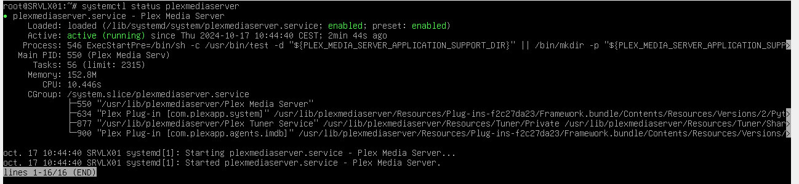

# Doc admin

## Pré-requis techniques
- Virtualbox
- Os serveur Debian (Interface 1 : Réseau interne, Interface 2 : NAT)
- OS client Ubuntu 24.04 (Interface 1 : Réseau interne, Interface 2 : NAT)
- OS client Windows 10 (Interface 1 : Réseau interne, Interface 2 : NAT)

# Configuration du serveur Debian 12

## Visualiser la configuration réseau actuelle :

Afficher la configuration réseau actuel de la machine.
- ip a
  
Puis trouver l'interface correspondante à la carte réseau connectée au réseau local et Nat. 

## Définir une adresse IP fixe :
Nous allons éditer le fichier de la carte réseau
- sudo nano /etc/network/interfaces
  
Dans le fichier, en dessous de the loopback network interface. Modifier la carte réseaux primerais et rajouter la secondaire (Nat).

[Debian12 IP](IMAGES/Image1Debian12.png)

- #The primary network interface

Auto enp0s3

Iface enp0s3 inet static
	
 address 172.16.10.10
	
 netmask 255.255.255.0

- #The secondary network interface

Auto enp0s8

Iface enp0s8 inet dhcp

Une foi terminer, sauvegarder puis fermer le fichier.

## Visualiser la nouvelle configuration réseau :

Redémarré le service qui gère le réseau.
- Systemectl restart networking

On vérifie la nouvelle configuration réseaux.
- Ip a
  
Vous pouvez voir que les 2 cartes réseaux ont été modifier.

Vérifier que vous savez de la connexion au réseau.
- ping 8.8.8.8

## Renommer la machine :

Pour changer le nom de la machine.
- Sudo nano /etc/hostname
  
Puis mettez un nouveau nom (par exemple SRVLX01)

Une fois changé, sauvegarder puis fermer.

Pour indiquer aux autres machines le nom du serveur sur le réseau.
- Sudo nano /etc/hosts
  
Nous allons modifier le nom afin qu’il soit bien pris en compte (par exemple SRVLX01)
- 127.0.1.1	SRVLX01

Rajoutez en dessous les autres machines si vous souhaitez communiquer avec elles (exemple ci dessous).
- 172.16.10.20	 CLIWIN01
- 172.16.10.30	 CLILIN01
  
Une foi terminer, sauvegarder puis fermer

Faite un redémarrage de la machine pour prendre en compte le nouveau nom.
- reboot
  
Une foi redémarrer, le nouveau nom de la machine apparaît.

# **Installation de Plex sur serveur Debian 12**
 
## **Mettre à jour le système Debian avant l'installation de Plex**
 
Commencez par mettre à jour votre système Debian afin d'assurer un processus d'installation fluide. Cela permet de s'assurer que tous les paquets existants sont à jour :
 
> **sudo apt update && sudo apt upgrade**
 
## **Installer les paquets requis pour Plex**
 
L'installation de Plex nécessite des paquets supplémentaires. Installez-les en exécutant la commande suivante :
 
> **sudo apt install dirmngr ca-certificates software-properties-common apt-transport-https curl -y**
 
Ces paquets fournissent les outils nécessaires pour gérer le dépôt Plex, notamment les connexions sécurisées et la gestion des clés GPG.
 
## **Ajouter le dépôt APT de Plex**
 
Ajoutez le dépôt Plex à votre système Debian pour installer Plex depuis la source officielle. Cela vous permet d'installer et de mettre à jour le logiciel directement à partir du dépôt officiel en utilisant le gestionnaire de paquets APT.
 
Tout d'abord, ouvrez votre terminal et importez la clé GPG de Plex avec la commande suivante :
 
> **curl -fsSL [https://downloads.plex.tv/plex-keys/PlexSign.key](https://downloads.plex.tv/plex-keys/PlexSign.key) | gpg --dearmor | sudo tee /usr/share/keyrings/plex.gpg > /dev/null**
 
Cette commande **télécharge et convertit la clé GPG de Plex**, qui est utilisée pour vérifier l'authenticité des paquets provenant du dépôt.
 
Ensuite, ajoutez le dépôt Plex à votre système :
 
> **echo "deb [signed-by=/usr/share/keyrings/plex.gpg] [https://downloads.plex.tv/repo/deb](https://downloads.plex.tv/repo/deb) public main" | sudo tee /etc/apt/sources.list.d/plexmediaserver.list**
 
Cette commande **crée un nouveau fichier dans le répertoire sources.list.d** avec les informations nécessaires pour accéder au dépôt Plex.
 
## **Installer Plex Media Server via APT**
 
Avant d'installer Plex, mettez à jour l'index des paquets pour inclure le nouveau dépôt Plex que vous venez d'ajouter :
 
> **sudo apt update**
 
Vous pouvez maintenant installer Plex Media Server sur Debian avec la commande suivante :
 
> **sudo apt install plexmediaserver**
 
Pendant l'installation, une invite peut vous demander si vous souhaitez remplacer la liste des référentiels. Tapez **«N»** pour continuer l'installation, car la clé GPG signée correcte est déjà en place.
 
## **Vérifier l'installation de Plex Media Server**
 
Par défaut, le service Plex Media Server devrait démarrer automatiquement. Pour vérifier cela, utilisez la commande suivante pour afficher l'état du service :
 
> **systemctl status plexmediaserver**

----------

## FAQ :

### Comment mettre à jour Plex Media Server ?
Plex propose souvent des mises à jour pour améliorer la stabilité, la sécurité et ajouter de nouvelles fonctionnalités :
Sous Linux : Utilisez les gestionnaires de paquets :
- bash
- sudo apt update
- sudo apt upgrade plexmediaserver

