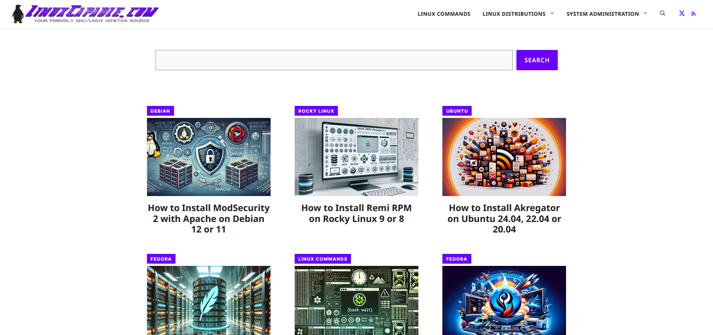
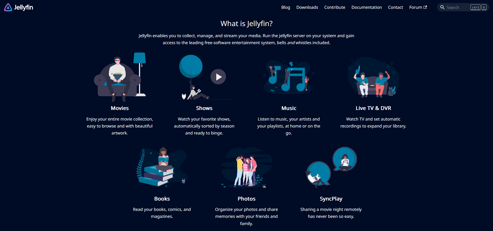

# TSSR-2409-JAUNE-P1-G1-ServeurDeContenusMultimedia

## Présentation du projet
L'**objectif principal** du projet est de créer un serveur et d'y installer un service qui agira comme une plateforme centralisée pour stocker, organiser et diffuser divers types de médias.
L'**objectif secondaire** est de mettre en place la configuration avancée des bibliothèques de médias et des métadonnées. Ce projet pourra servir dans le futur comme base, pour faire fonctionner un serveur NAS dédié à la gestion de fichiers multimédias. 

## Introduction : 
Dans un monde où la consommation de contenus multimédias ne cesse d’augmenter, il devient essentiel pour les entreprises et les particuliers de disposer d'une solution centralisée pour gérer leurs médias numériques. Ce projet répond à ce besoin en proposant une plateforme flexible et performante, capable de s'adapter à différents environnements et besoins.

## Membres du groupe :
| Nom                           | Sprint 1      | Sprint 2      |
|-------------------------------|---------------|---------------|
| Baudouin Soubrier De Gaudemar | Product Owner | Exécutant     |
| Erwan Salomon                 | Scrum Master  | Exécutant     |
| Marilyn Jacques-Sébastien     | Exécutant     | Scrum Master  |
| Lamine                   | Exécutant     | Product Owner |

## Choix techniques :

Le projet a deux impératifs techniques. La VM serveur doit fonctionner sous [Debian 12](https://www.debian.org/) et le logiciel de gestion de contenus doit être [Plex](https://www.plex.tv/). Pour nos VMs clients, nous pouvons utiliser tous les OS.
Nous avons donc privilégié les OS [Windows 10](https://www.microsoft.com/fr-fr/software-download/windows10%20) et [Ubuntu 24.04 LTS](https://ubuntu.com/blog/tag/ubuntu-24-04-lts), qui sont les OS que nous avons le plus utilisé lors de notre début de formation.
Chaque VM devait suivre une pré-configuration précise détaillée dans le tableau ci-dessous :
OS          |Nom     |Compte                     |Mdp     |Adresse IP     
------------|--------|---------------------------|--------|---------------
Debian 12   |SRVLX01 |root                       |Azerty1*|172.16.10.10/24
Ubuntu 24.04|CLILIN01|wilder (groupe sudo)       |Azerty1*|172.16.10.20/24
Windows 10  |CLIWIN02|wilder (groupe admin local)|Azerty1*|172.16.10.30/24

## Difficultés rencontrées

Malgré une nouvelle méthodologie de travail de groupe, nous avons su nous adapter rapidement, ce qui nous a grandement aidé pour le reste des sprints. Cependant, le premier projet en groupe, nous a confronté de nombreuses fois à des soucis sur le plan technique. Tout d'abord un premier problème logistique pour exporter des VMs configurées par Baudouin; lié à un manque d'informations de notre part. Puis, lors de l'installation du service Plex Media Server, nous avons fait face à 3 problèmes majeurs.

### [La documentation](https://support.plex.tv/articles/) Plex
Dans un souci de vouloir faire les choses correctement, nous nous sommes basés sur la documentation de Plex pour son installation sur notre serveur Debian. Les plusieurs dizaines d'articles présents dans la catégorie Plex Media Server, et un suivi scrupulueux des étapes d'installation nous ne parvenions toujours pas à installer le service. Après plusieurs essais et approches différentes via la documentation officielle, nous avons cherché d'autres sources afin de réussir.
Cela nous a fait perdre plusieurs heures précieuses et cela nous a obligé à recommencer sur une VM Debian de zéro.

### VM Serveur & Connexion Ubuntu
Travailler sur Debian 12 pour la première fois a eu son lot de problèmes. Notamment, des soucis techniques liés à des erreurs de type "unexpected error" qui ne nous indiquent pas ou bien peu d'informations sur le noeud du problème. En effet, le manque de sujets/topics pour une installation de Plex sur un serveur Debian n'a pas rendu la tâche de débogage facile. Les utilisateurs de Plex utilisant majoritairement d'autres configurations, comme par exemple [Docker](https://www.docker.com/) sur un serveur NAS privé. Par ailleurs, des arrêts intempestifs de connexion de la carte réseau interne sur Ubuntu 24.04 LTS a conduit à des pertes de temps considérables. Ce problème survenant en fin de sprint 1, nous a handicapé jusqu'à la veille de la présentation du sprint n°2.  

### L'installation Plex
Évoqué ci-dessus, l'installation du service a été complexe par manque d'informations claires et compatible avec Debian 12. Après plusieurs téléchargements de versions de Plex non-compatibles, nous nous étions tournés vers d'autres documentations. Cependant, la plupart des sources ne présentaient que des étapes sommaires, sans explications ni d'alternatives à des problèmes lors de l'installation.   

## Solutions/Alternatives trouvées :

### Documentation Plex
Après de nombreux tests, nous avons choisi de suivre la documentation de [Joshua James](https://twitter.com/joshism_j) sur le site https://linuxcapable.com/. C'est la seule documentation qui, en plus d'être claire et concise, explique et propose des éléments supplémentaires comme la configuration des droits de l'utilisateur plex sur la VM serveur. 

### VM Serveur & Connexion Ubuntu
Malgré la frustration, les nombreuses installations échouées de Plex, nous ont permis de nous adapter à un environnement CLI. Nous avons également pu comprendre la majorité des erreurs liées aux lignes de     commandes exécutées, soit par une explication trouvée sur des forums comme [Stack Overflow](https://stackoverflow.com/) ou bien en examinant scrupuleusement la syntaxe des commandes. Pour tous les problèmes liés à la connectivité de la carte réseau interne, nous avons contacté notre formateur qui n'a pas pu, à ce jour, trouver une solution pérenne. La piste d'un problème lié à l'hyperviseur VirtualBox est la plus probable.

### Installation Plex
L'installation est très simple à conditions de suivre le bon chemin. Choisir la documentation alternative de J.James nous a permis de faire une installation du service en moins de dix minutes montre en main.  Nous avons pu finaliser l'installation et la configuration de Plex via le WebGUI. C'est grâce à cette interface côté VM client que nous avons pu atteindre notre objectif secondaire. Cette fois-ci la documentation officielle a été utile dans la configuration avancée du service.

## Améliorations proposées :
- Une première amélioration serait de sécuriser la connexion via url de HTTP à HTTPS. Cela serait une priorité même si on utiliserait Plex en local uniquement.
- Sélectionner et installer manuellement des agents de métadonnées supplémentaires, par exemple [Colima](https://github.com/defract/Colima.bundle)  pour les amteurs de documentaires ou [Seasnap](https://github.com/seanap/Plex-Audiobook-Guide) pour les audio-livres.
- Changer de service pour [Jellyfin](https://jellyfin.org/), une alternative en logiciel libre sous licence GNU GPL

  
